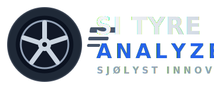

<p align="center">
  
</p>

<p align="center">
  Tyre temperature across the tread, on every wheel, throughout a track session.
</p>

---

SI Tyre Analyzer is a set of wheel sensors plus a desktop app. A thermal sensor
on each wheel records temperature across the tyre **inner → middle → outer** for
the whole session; the app shows tread profile, balance, temperature over time,
and time in the target window.

## What's in the box

- **4 wheel units** — one ESP32-S3 + MLX90640 thermal sensor per wheel, logging
  to internal memory.
- **1 dash master** — a sensorless unit that starts and stops all four wheels
  together and shows a **live** 4-wheel view.
- **SI Tyre Analyzer** — the desktop app (Windows, macOS, Linux) for downloading
  and analysing runs.

---

## Quick start

### 1. Install the app

One command installs everything (the `uv` runtime, the app, and — on Windows — a
desktop shortcut):

- **Windows** (PowerShell):
  ```powershell
  irm https://raw.githubusercontent.com/sondresjolyst/si-tyre-analyzer/main/tools/install/install.ps1 | iex
  ```
- **macOS / Linux**:
  ```bash
  curl -LsSf https://raw.githubusercontent.com/sondresjolyst/si-tyre-analyzer/main/tools/install/install.sh | sh
  ```

Then launch **SI Tyre Analyzer** from the desktop shortcut, or run
`si-tyre-analyzer` in a terminal.

### 2. Pair a car (once)

Each car uses a **Car ID**.

1. Power on every unit. Hold the button **~8 s** to put one into config mode — it
   appears as a Wi-Fi network named `SITA <wheel> <Car ID>`.
2. Join that network and open the page that pops up (or visit
   `http://192.168.4.1`). Set the **same Car ID** on every unit.
3. On the **master**, press **Pair wheels**; the wheels join automatically.

Pairing is saved across power cycles.

### 3. Record a session

- **Tap** the master's button to start; tap again to stop. All four wheels record
  together, time-aligned.
- The status LED is solid while recording.
- Recording stops on its own at the session time limit.

### 4. Download and analyse

1. Connect your laptop to the master's Wi-Fi.
2. Open the app → **Sessions** → **List sessions**, then download the run (see
   below).
3. Open it in **Viewer** and **Analysis**.

---

## The app

| Page         | What it's for                                                                                                         |
| ------------ | --------------------------------------------------------------------------------------------------------------------- |
| **Sessions** | List runs on a connected device and download them into your local library. Configure a device or update its firmware. |
| **Live**     | Connect to the master (`192.168.4.1`) and watch all four wheels update live.                                          |
| **Viewer**   | Replay a run — scrub and play the four heatmaps with a speed control.                                                 |
| **Analysis** | Tread profile (inner / middle / outer), temperature over time, time-in-window, and front/rear & left/right balance.   |

### Downloading runs

On the **Sessions** page, after **List sessions**:

- **Double-click** a session, or select it and click **Download selected**, to
  grab just that run.
- **Download all** pulls everything on the device.

Runs land in your local library and are grouped automatically by session.

### Configuring a device

On **Sessions**, **Configure…** opens the device's own web page where you set
role, wheel, Car ID and sensor options.

---

## Keeping things up to date

The app updates itself, and the car's firmware updates over Wi-Fi from the app —
see [docs/updating.md](docs/updating.md).

---

## The device, in detail

**One firmware for every unit.** All five units run the same
`firmware_si_tyre_analyzer_v<ver>.bin`; role (master/wheel), wheel position and
whether a sensor is fitted are settings stored on the device and changed from its
web page — never reflashed per unit.

**Button (one button, by hold time):**

| Gesture   | Action                                                 |
| --------- | ------------------------------------------------------ |
| Tap       | Start / stop recording (master controls the whole car) |
| Hold ~3 s | Enter pairing                                          |
| Hold ~8 s | Enter Wi-Fi config mode (`SITA <wheel> <Car ID>`)      |

**Status LED:** solid while recording, blinks in config mode, and shows the
button gesture stage while you hold it.

**Config mode** (hold ~8 s) serves the device web page: settings, session
downloads, and a manual firmware `.bin` upload — everything the app does is also
available here from a phone or laptop browser.

---

## For developers

<details>
<summary>Build, flash, and test from source</summary>

### Build & flash (PlatformIO)

```bash
pio run -e esp32-s3-devkitc-1            # default: mock sensor
pio run -e esp32-s3-devkitc-1 -t upload  # flash the same bin to every unit
```

For the real sensor set `custom_sensor_type = mlx90640` in `platformio.ini`. The
`custom_*` role/wheel values only seed first-boot config; change them per device
in the web UI.

### Run the app from source

1. Install **Python 3.10+** (on Windows tick "Add Python to PATH") and **uv**:
   - Windows: `irm https://astral.sh/uv/install.ps1 | iex`
   - macOS / Linux: `curl -LsSf https://astral.sh/uv/install.sh | sh`
2. Run it:
   ```bash
   cd tools
   uv run si-tyre-analyzer
   ```

Behind a TLS-intercepting proxy, add `--native-tls`.

### CLI

```bash
cd tools
uv run sita info       <run>.bin
uv run sita heatmap    <run>.bin --save out.mp4
uv run sita dashboard  ~/SI_Tyre_Analyzer_Runs
uv run sita fetch --host 192.168.4.1 --all --dest ~/SI_Tyre_Analyzer_Runs
```

### Tests

- Native unit tests: `pio test -e native_downsample -e native_logformat -e native_version`
  (needs a host C++ compiler).
- Python contract test: `cd tools && uv run pytest`.

### Notes

- Each wheel unit downsamples the MLX90640's 32×24 frame to a 9×5 grid (tread
  width × rows) and logs that to LittleFS.
- The master coordinates over **ESP-NOW** and serves the live dashboard over its
  own Wi-Fi AP; the device never joins a router.
- Libraries are vendored under `lib/` (ArduinoJson; the `mlx90640` build also uses
  Adafruit MLX90640 + Adafruit Unified Sensor).
- Optional dashboard screen: see [docs/dash-gauge.md](docs/dash-gauge.md).

</details>
